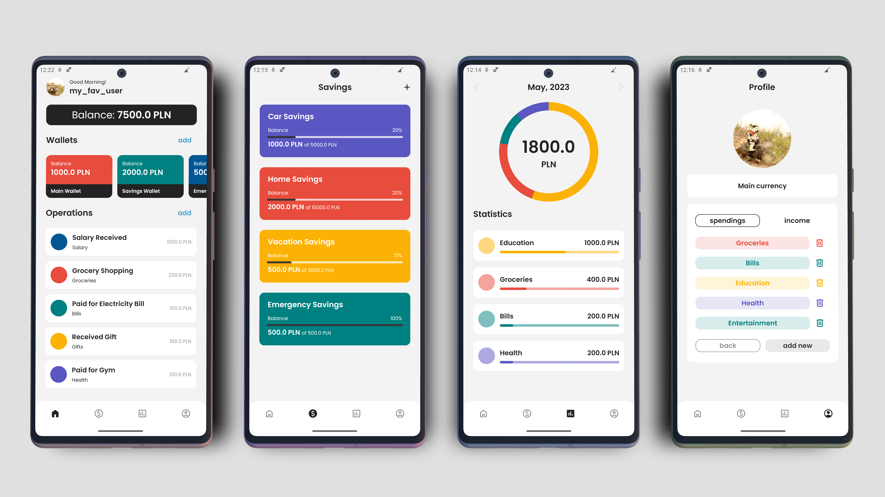

# FMoney

Welcome to FMoney! This app has been my dream ever since I began my Android journey. And now I'm thrilled to start working on it together with the community!

## Features

- **Set Savings Goals:** Set financial goals and track your progress towards achieving them. Stay motivated and visualize your savings journey.
- **Wallet Management:** Manage multiple wallets within the app. Keep track of your balances and have a comprehensive view of your finances.
- **Manual Transaction Logging:** Log your financial transactions manually, including income, expenses, and transfers. Maintain a detailed record of your financial activities.
- **Categorize Transactions:** Categorize your transactions to better organize and analyze your spending habits. Gain insights into your financial patterns.
- **Detailed Statistics:** View statistics to gain valuable insights into your financial habits. Identify areas for improvement and make informed decisions.

## Installation

To install FMoney, follow these steps:
- Go to the "Releases" section of this repository.
- Download the latest APK file.
- Install the APK on your Android device.
- Launch FMoney and enjoy!

## Contributing

If you have any questions, suggestions or issues regarding this project, don't hesitate to contact me at paulmais.dev@gmail.com – contributions and feedback are highly appreciated ;)

## Credits

**Device Mockup:** Image created from [Google Pixel 6 mockups](https://deviceframes.com/templates/google-pixel-6).

## License

FMoney is licensed under the [LICENSE](LICENSE.txt) file. Please review the license for detailed information on permissions and restrictions.
